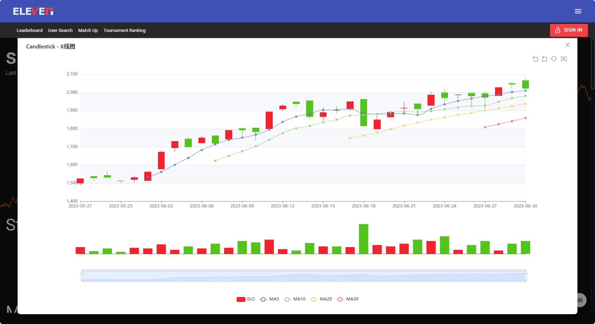

# Eleven table tennis vr k线图

## 安装
1. 安装油猴插件
    - [edge 篡改猴 (Tampermonkey) ](https://microsoftedge.microsoft.com/addons/detail/%E7%AF%A1%E6%94%B9%E7%8C%B4/iikmkjmpaadaobahmlepeloendndfphd)
    - [chrome 篡改猴 (Tampermonkey) ](https://chrome.google.com/webstore/detail/tampermonkey/dhdgffkkebhmkfjojejmpbldmpobfkfo)
3. 点击安装此脚本：[elevenvr-candlestick.user.js](https://github.com/shijianjs/elevenvr-candlestick/raw/master/dist/elevenvr-candlestick.user.js)

## 技术

[vite-plugin-monkey](https://github.com/lisonge/vite-plugin-monkey/blob/main/README_zh.md)

## 预览

在 [https://elevenvr.net](https://elevenvr.net) 页面搜索自己的id，进入自己的页面，如下这个链接：
[https://elevenvr.net/eleven/1648377](https://elevenvr.net/eleven/1648377)

脚本安装后右下角会有一个悬浮按钮，点击可以打开k线图，由echarts实现。

## todo
- [ ] 成交量图加上输几场、赢几场
- [ ] 点击k线图弹出当日交手详情列表

